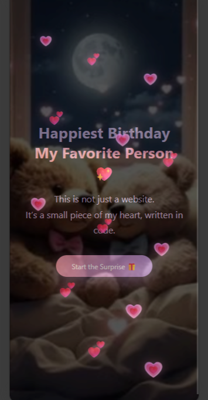
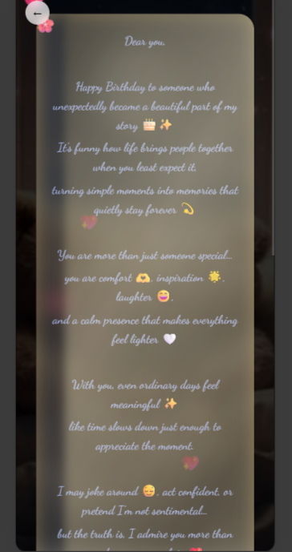
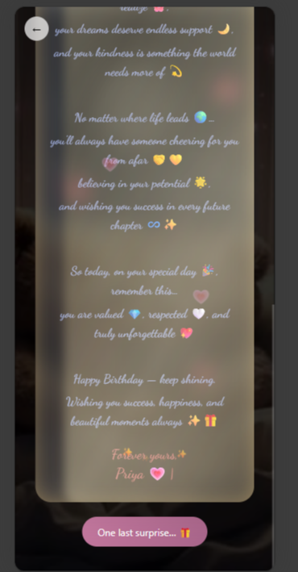
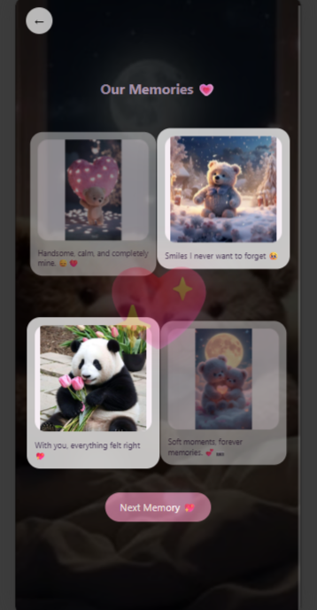
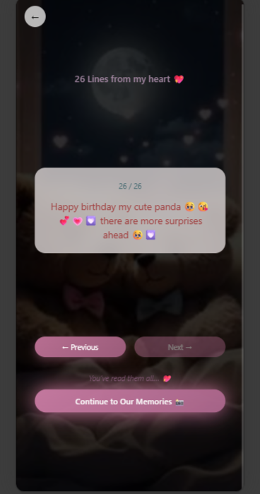
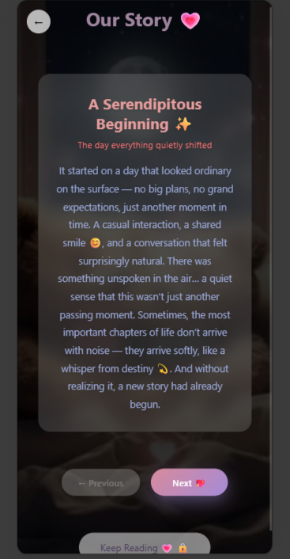

# 🎂 Love Birthday Surprise — Interactive Celebration Website

An emotionally engaging, fully interactive birthday surprise web experience designed and developed for a real client.
This platform was deployed and actively used by the client and their family, creating a memorable digital celebration that blends storytelling, music, visuals, and animations.

> Built to transform a personal moment into an immersive digital experience.

---

## 🚀 Live Project

- 🌐 **Deployed Website:** *[https://birtday-surprise-navy.vercel.app/]*
- 💻 **GitHub Repository:** *[https://github.com/patelkarma/love-birthday-surprise.git]*

---

## 💡 Project Overview

This project is a storytelling-based birthday surprise website that takes the user through a carefully crafted emotional journey using:

* Animated storytelling
* Countdown experience
* Love letter section
* Relationship timeline
* Personal gallery
* Reasons section
* Final cinematic story reveal
* Background music & particle effects

The goal was to create a digital memory experience rather than just a static website.

---

## 🧠 Problem Statement

Traditional birthday wishes feel temporary and generic.
The client wanted something:

* Personal
* Emotional
* Visually immersive
* Memorable
* Shareable with close family

This project solves that by converting memories into an interactive digital journey.

---

## ✨ Key Features

### 🎬 Immersive Story Experience

* Page-based storytelling flow
* Smooth transitions & scroll animations
* Emotional progression from intro → memories → final story

### 💌 Love Letter Section

* Personalized heartfelt message
* Designed with emotional UI aesthetics

### 🖼️ Memory Gallery

* Image-driven storytelling
* Organized emotional highlights

### ❤️ Reasons Section

* Dynamic display of reasons & memories
* Card-based animated presentation

### 🕰️ Relationship Timeline

* Milestone visualization
* Chronological emotional narrative

### 🎵 Music Integration

* Background music player
* Context-aware emotional immersion

### 🌟 Final Story Reveal

* Cinematic animated sequence
* Particle effects, glow layers, stars, hearts overlays
* Complete emotional closure moment

---

## 🛠️ Tech Stack

### Frontend

* React.js
* JavaScript (ES6+)
* CSS3 (Custom animations + styling)
* Component-based architecture

### Libraries & Concepts Used

* React Hooks
* Context API
* Custom Hooks
* Framer-style animation patterns
* Particle & motion effects
* Modular folder architecture

---

## 📂 Project Structure

```
src/
 ├── components/
 │   ├── common/
 │   ├── navigation/
 │   ├── ui/
 │
 ├── pages/
 │   ├── Landing/
 │   ├── Countdown/
 │   ├── LoveLetter/
 │   ├── Gallery/
 │   ├── Reasons/
 │   ├── Timeline/
 │   ├── FinalStory/
 │
 ├── assets/
 ├── hooks/
 ├── data/
 ├── animations/
 ├── styles/
 └── utils/
```

Designed for scalability and feature-based expansion.

---

## 🧪 Real-World Usage

* Developed for a real client
* Deployed and shared with family members
* Received extremely positive emotional feedback
* Successfully achieved intended purpose: a memorable digital birthday experience

This demonstrates:

* Client requirement understanding
* UI/UX emotional design capability
* Real-world deployment experience

---

## 🎯 What Makes This Project Stand Out

- ✔ Emotion-driven UX, not just functionality
- ✔ Storytelling-focused product thinking
- ✔ Real client delivery
- ✔ Production deployment
- ✔ Advanced animations & visual layering
- ✔ Clean React architecture
- ✔ Strong UI sense

This is not just a project — it's a **digital experience product.**

---

## 📸 Screenshots

### 🏠 Landing Experience


---

### 💌 Love Letter Section



---

### 🖼️ Memory Gallery


---

### ❤️ Reasons Section


---

### 🕰️ Relationship Timeline


---

### ⏳ Final Story Experience


---

## ⚙️ Installation & Setup

```bash
# Clone the repository
git clone https://github.com/your-username/project-name.git

# Navigate to project
cd project-name

# Install dependencies
npm install

# Run project
npm start
```

---

## 🌍 Deployment

Deployed using modern hosting platforms for real-time user access.

You can deploy using:

* Vercel
* Netlify
* Firebase Hosting

---

## 📈 Learnings & Outcomes

* Building emotion-driven UI
* Structuring scalable React apps
* Managing animations & performance
* Delivering client-centric solutions
* Turning personal ideas into production products

---

## 👩‍💻 Developer

**Karma Patel**
Frontend-focused developer with strong frontend execution capability.

* React.js
* Spring Boot
* Microservices
* SQL & NoSQL
* Production deployment experience

- 📧 Email: [patelkarma28@gmail.com](mailto:patelkarma28@gmail.com)
- 🔗 GitHub: github.com/patelkarma

---

## ⭐ Final Note

This project reflects the ability to:

* Think beyond code
* Build experiences, not just pages
* Deliver real value to real users

If you're looking for someone who can combine **technical skills + product thinking + emotional UX**, this project represents exactly that.

